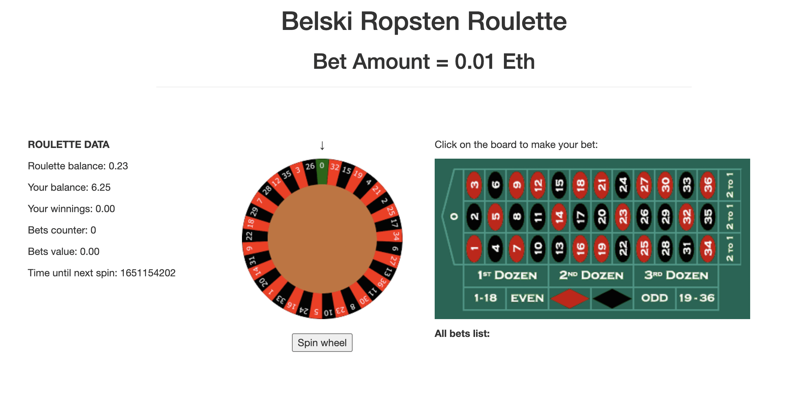
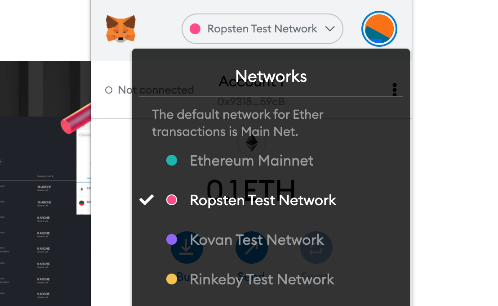

# eth-roulette-for-blockchain-presentation
Ethereum blockchain roulette implementation using smart contracts and Web3.
Prepared for blockchain presentation.

To take part in game you will need metamask extension installed.

#Step 1 

Connect metamask to Ropsten testnet.

- Open MetaMask extension and click on the dropdown icon of the network name.
- Select "Ropsten Test Network" as the current network.

#Step 2

Get some test ether to your address, to do so please visit [https://faucet.egorfine.com/] or [https://faucet.metamask.io/]

#Step 3

Make a bet on the roulette.

#Step 4

Spin the wheel and see if you win.

